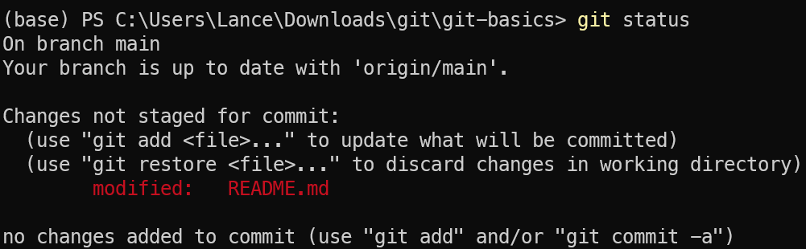
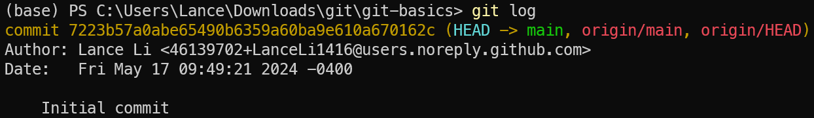

# Git Basics

> **MUST KNOW**: *4. Staging Files*, *5. Committing*

## 1. Configure Git

Open your terminal and configure the Git username and email:

```sh
git config --global user.name "Your Name"
git config --global user.email "email@example.com"
```

## 2. Initialize a repository

This step has already been done for you.

To use Git in your project, use `git init`

```sh
cd [Project Path]
git init
```

## 3. Checking Status

Use `git status` to check the current status of the repo.

```sh
git status
```


## 4. Staging Files

Staging allows you to prepare specific changes before committing them to the repository. 

1. You start by making changes to file in the working directory. For example, I am currently editing `README.md`.
2. Use `git add [file]` command to add changes in the staging area. This is an intermediate area before committing them. Think of it as a way to review and organize your changes. 
```sh
# Stage a specific file
git add README.md
# Stage all files
git add .
```
When you stage changes, Git takes a snapshot of the current state of the files you've added and stores that snapshot in the staging area.

## 5. Committing

Once you have staged the changes, you can commit them to the repository using the `git commit` command. This action records the changes in your project's history.

```sh
git commit -m "A meaningful commit message"
```

> *Lance:* I recommend starting the commit message with a verb, and make this message short. For example, "Add README.me", "Update player model", or "Fix GameManager.cs".

> *Lance:* If you realize you need to fix some minor issues (like a typo) that does not deserve a commit, you can append it to your previous commit via
> ```sh
> git add filename
> git commit --amend --no-edit
> ```
> However, you can only do this **BEFORE** you push the commit.

## 6. Viewing Commit History

To see the commit history, run 
```sh
git log
```



## Try it Yourself!

In the repo, I have created a `file.txt`. Edit this file and add things you like (maybe quote of the day)? Then, stage and commit your changes.

To `push` (update) your changes to remote (in our case, GitHub), run the following

```sh
git push -u origin main
```

Pushing will be explained in [Branching](https://github.com/EVOGAMI/git-branching).

***Congratulations! You now know the basics of git!***